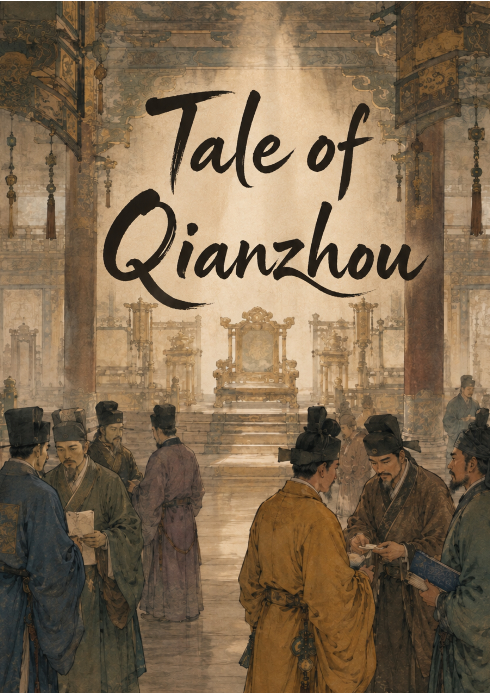

<!-- Replace with your actual hosted cover image path once uploaded to /images -->

# Tale of Qianzhou

*A realm with no rightful ruler — only whoever holds the leverage this season.*

**[▶ Play on Voyage](https://voyage.io/PLACEHOLDER-LINK)**

---

## What this is

No dynasty holds Qianzhou whole. No throne commands universal loyalty. It's not a kingdom mid-collapse — it's a world that has simply always worked this way, and it doesn't need you to fix it, save it, or unify it. It just needs you to decide what you're willing to do to get what you want.

Play a general, a merchant, a servant, a ruling-house scion, or a warlord building something from nothing. No magic, no monsters, no wuxia superhuman feats — just real people with real training, real fear, and real limits, in a Song-dynasty-inspired world where politics is the real battlefield.

**[Read the full pitch on the Voyage listing →](https://voyage.io/world/HE9eFfjRUV_z/tale-of-qianzhou?share=true&published=true)**

---

## Three ways to play

Via the included **Compass Vantage** mode system:

| Mode | What it's about |
|---|---|
| 🏠 **The Quiet Life** | Relationships, routine, small human stakes |
| ♟️ **The Long Game** | Standing, alliance, and leverage, played patiently |
| 📈 **Ambition** | Building something real from nothing |

## Mods included

Both mods are also standalone-installable in your own worlds:

- **[Compass Vantage](https://voyage.io/mod/4L5bkXTAIytJ/compass-vantage?share=true&published=true)** — game modes built on "the story always moves forward, only the direction changes"
- **[Human First](https://voyage.io/mod/hAvvh509GUKe/human-first?share=true&published=true)** — NPC intents where every action traces back to something specific to that character, never scene convenience

---

## 📋 Patch Notes & Updates

- **[CHANGELOG.md](CHANGELOG.md)** — summary of what's changed, version by version
- **[Updates folder](updates/)** — if your save needs a manual update, start here for the latest version's instructions

## 💬 Feedback & Bug Reports

Found something broken, or have a suggestion? Open an [issue](../../issues) on this repo, or reach out at PLACEHOLDER-CONTACT.

## 🗺️ About the world

- 36 named circuits across a fully realized realm map
- Multiple ruling houses with real internal politics and vulnerabilities
- Peak-human realism — no magic, no supernatural feats
- No real historical figures, dynasties, or place names — cultural texture is authentic to the era, geography and politics are fully invented

---

Tale of Qianzhou is built on the Voyage platform. This repo is an unofficial companion hub, not affiliated with Latitude.

